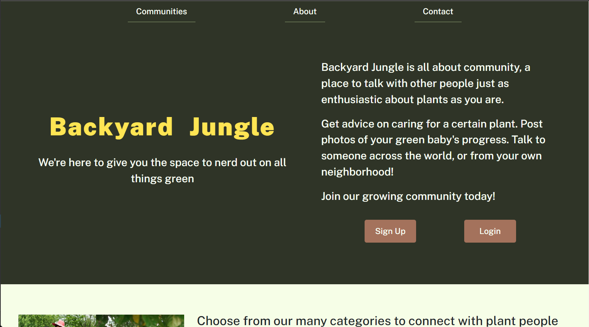
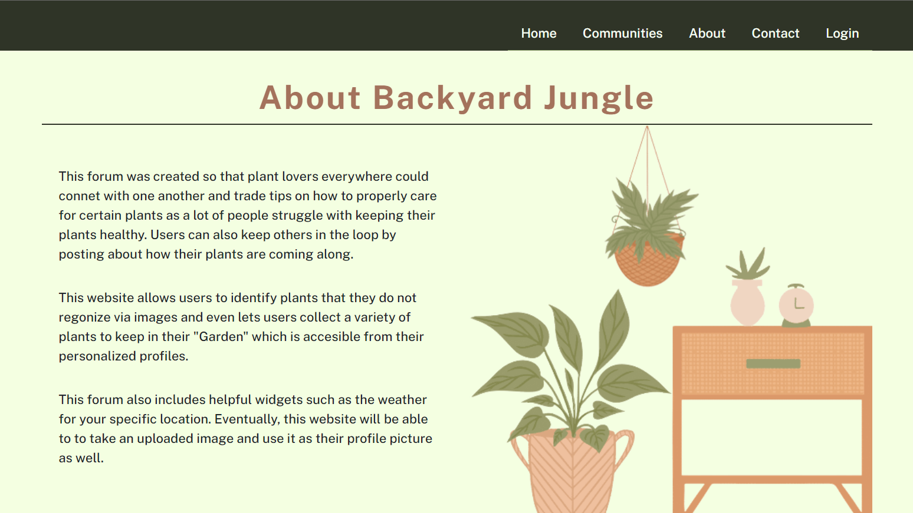
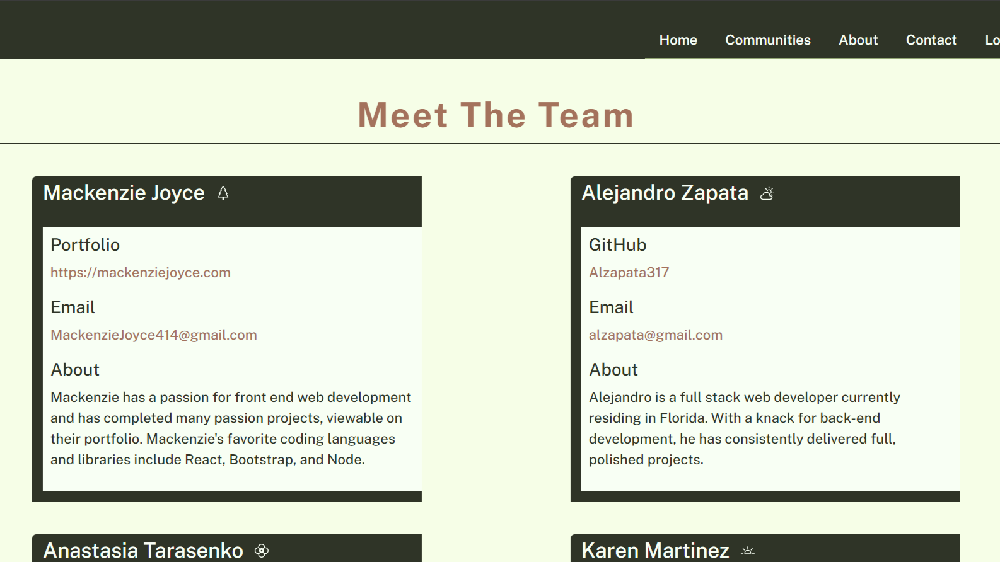
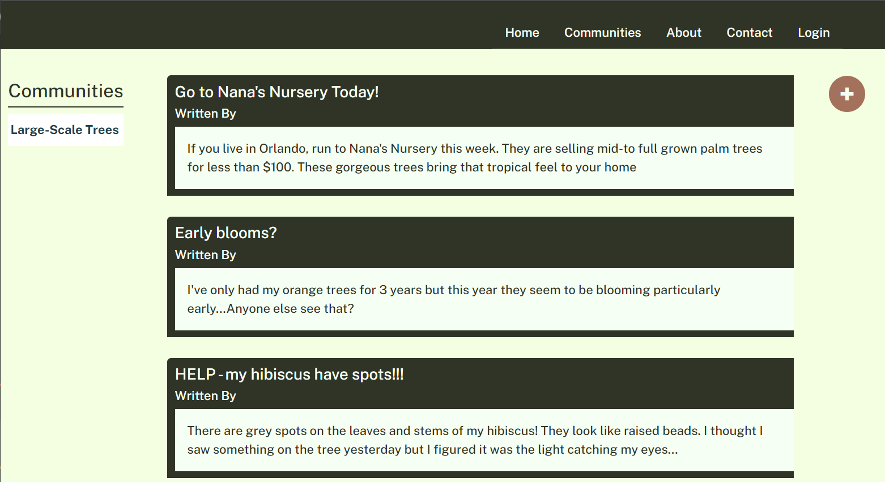

# Backyard Jungle

## About the Project
Welcome to the GitHub page for Backyard Jungle, the site for all plant lovers! 
This repository is a fork of a group project. I am the sole contributor to this fork. The names of previous contributors are listed in the contact section below. 

## Built with:
-HTML

-CSS

-Handlebars

-JavaScript

-Node.js

-Express.js

-Bcrypt

-Axios

-Connect-session-sequelize

-Sequelize

-mysql2

-Dotenv

## Usage
 Using our site plant lovers may look up flowers, trees, and all sorts of plants thant they are interested in. They can chose to add them to their garden (or collection of plants). Users can also learn about species of plants and join communities where other garden-lovers, tree-lovers, sustainable-food-lovers post tips and tricks on their growing techniques.

## Contact
Email the team:

Mackenzie Joyce: <MackenzieJoyce414@gmail.com>

Alejandro Zapata: <alzapata@gmail>

Anastasia Tarasenko: <anastas.tarasenko001@mymdc.net>

Karen Martinez Guerrero: <ksmgps@hotmail.com>

Miranda Morton: <miranda.morton1@gmail.com>
